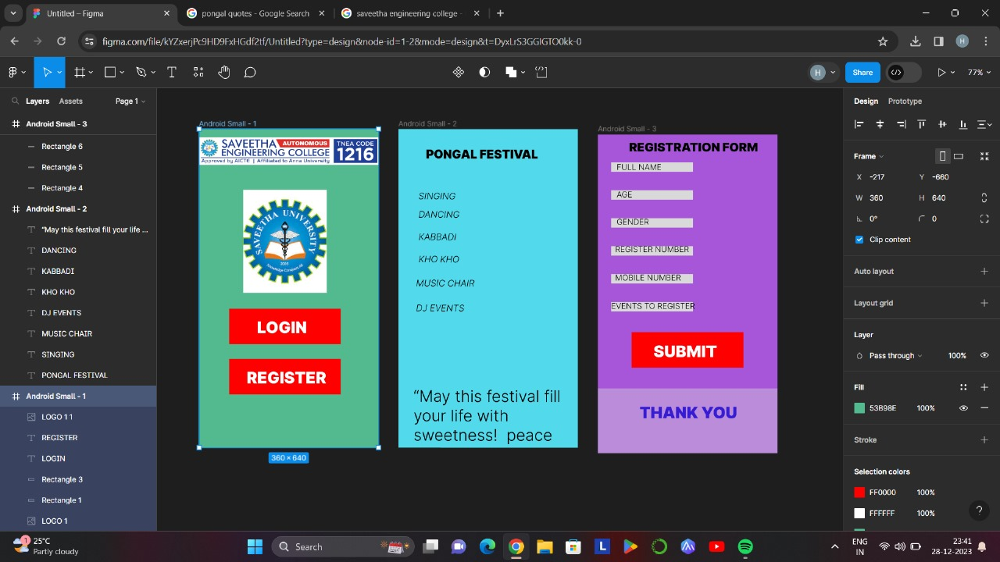

# Event Registration Web Application

## AIM:
To design, develop and deploy a web application for event registration.

## DESIGN STEPS:
### Step 1:
Create a new frame

### Step 2:
Select any one preset size of your choice

### Step 3:
Select the shapes you need

### Step 4:
Import images as needed

### step 5:
create a page you need and link them

### Step 6:
Validate the HTML and CSS code.
### Step 6:
Publish the website in the given URL.
## DESIGN:
fIGMA
## PROGRAM :
```html
<div style="width: 100%; height: 100%; position: relative; background: #53B98E">
    
    <div style="width: 224px; height: 71px; left: 60px; top: 361px; position: absolute; background: #FF0000"></div>
    <div style="width: 224px; height: 71px; left: 60px; top: 462px; position: absolute; background: #FF0000"></div>
    <div style="width: 165px; height: 33px; left: 116px; top: 379px; position: absolute; color: white; font-size: 32px; font-family: Inter; font-weight: 900; word-wrap: break-word">LOGIN</div>
    <div style="width: 165px; height: 33px; left: 95px; top: 480px; position: absolute; color: white; font-size: 32px; font-family: Inter; font-weight: 900; word-wrap: break-word">REGISTER</div>
    
</div>
<div style="width: 100%; height: 100%; position: relative; background: #52D9EB">
    <div style="width: 270px; height: 33px; left: 55px; top: 36px; position: absolute; color: black; font-size: 24px; font-family: Inter; font-weight: 900; word-wrap: break-word">PONGAL FESTIVAL</div>
    <div style="width: 173px; height: 33px; left: 40px; top: 123px; position: absolute; color: black; font-size: 18px; font-family: Inter; font-style: italic; font-weight: 300; word-wrap: break-word">SINGING</div>
    <div style="width: 173px; height: 33px; left: 35px; top: 298px; position: absolute; color: black; font-size: 18px; font-family: Inter; font-style: italic; font-weight: 300; word-wrap: break-word">MUSIC CHAIR</div>
    <div style="width: 173px; height: 33px; left: 35px; top: 348px; position: absolute; color: black; font-size: 18px; font-family: Inter; font-style: italic; font-weight: 300; word-wrap: break-word">DJ EVENTS</div>
    <div style="width: 173px; height: 33px; left: 40px; top: 250px; position: absolute; color: black; font-size: 18px; font-family: Inter; font-style: italic; font-weight: 300; word-wrap: break-word">KHO KHO</div>
    <div style="width: 173px; height: 33px; left: 40px; top: 205px; position: absolute; color: black; font-size: 18px; font-family: Inter; font-style: italic; font-weight: 300; word-wrap: break-word">KABBADI</div>
    <div style="width: 173px; height: 33px; left: 40px; top: 160px; position: absolute; color: black; font-size: 18px; font-family: Inter; font-style: italic; font-weight: 300; word-wrap: break-word">DANCING</div>
    <div style="width: 305px; height: 155px; left: 30px; top: 517px; position: absolute; color: black; font-size: 32px; font-family: Inter; font-weight: 300; word-wrap: break-word">“May this festival fill your life with sweetness!  peace prosperity, and happiness in your life!” “May happiness overflow in your life this year, good luck enter your home and success touch your feet.</div>
</div>
<div style="width: 100%; height: 100%; color: black; font-size: 16px; font-family: Inter; font-weight: 300; word-wrap: break-word">MOBILE NUMBER</div>
```
## OUTPUT:


## Result:
The program to design,develop and deploy a web for event registration is completeed successfully